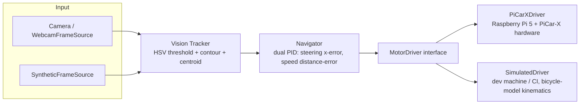
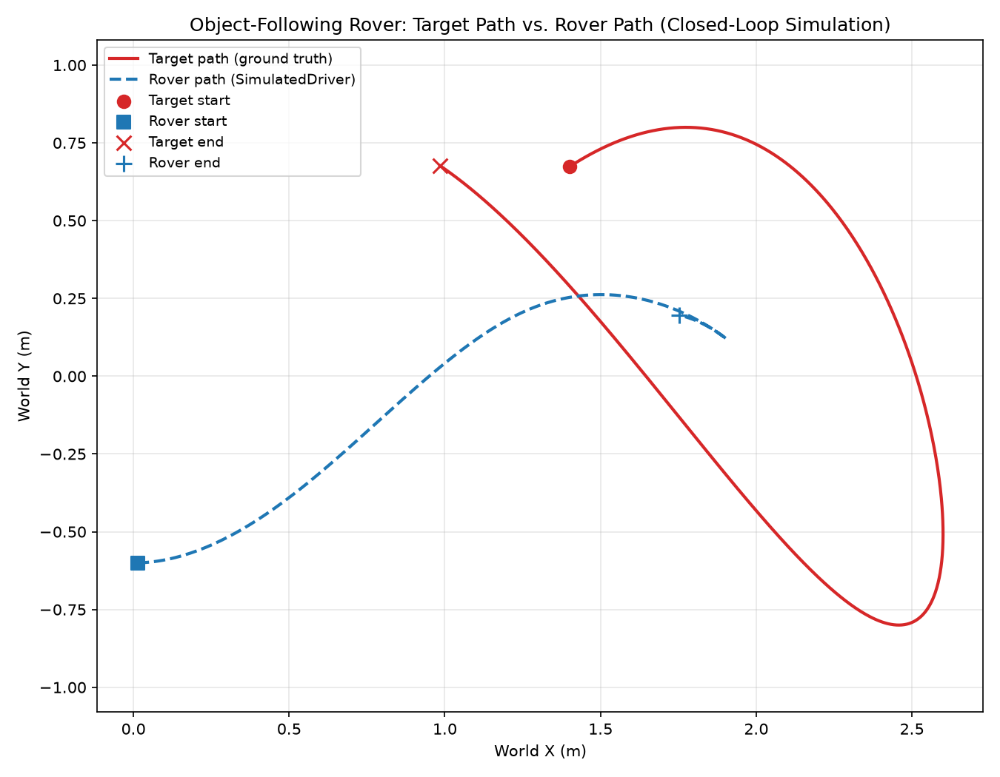
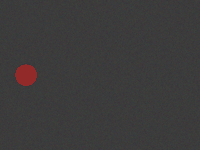

# Rover Vision Control

A closed-loop, vision-guided object-following control stack, built as the
software companion to a physical **Raspberry Pi 5 + SunFounder PiCar-X**
rover build. This repository holds the camera-based tracking, PID control,
and motor-driver logic, structured so the exact same code runs in full
simulation on a laptop with no camera or robot attached, and is designed to
run unmodified on the real hardware.

A color-thresholding vision tracker locates a target in each frame and
estimates its position and apparent distance. Two independent PID control
loops turn that into steering and speed commands. Those commands go through
a `MotorDriver` interface that is backed by either a kinematic rover
simulator or, on the physical build, the real PiCar-X hardware.

> **Hardware status:** everything in this repository has been built and
> validated in simulation (`SimulatedDriver`, synthetic camera frames, the
> full automated test suite). `PiCarXDriver` is written against the
> documented `picar-x` API, but it has not yet been run against the
> physical rover -- see [Limitations](#limitations-and-future-work).

## Architecture



### Why a hardware-abstraction layer

The vision and control code (`vision.py`, `pid.py`, `navigator.py`) never
imports anything Raspberry-Pi-specific. It only talks to a `MotorDriver`
interface (`drivers/base.py`) with `set_steering`, `set_speed`, `stop`, and
`get_status`. Two things follow from that:

1. **Development and testing happen entirely on a laptop.** `SimulatedDriver`
   implements the same interface with an in-process bicycle-model kinematic
   simulation, and `SyntheticFrameSource` generates synthetic camera frames
   with a controllable colored target, so the entire perception-to-actuation
   loop can be exercised, unit tested, and demoed with zero hardware
   attached.
2. **Deploying to the real rover is designed to change one line, not the
   algorithm.** `PiCarXDriver` implements the identical interface against
   the real SunFounder `picarx` library, written to match its documented
   method signatures (`Picarx()`, `set_dir_servo_angle()`, `forward()`,
   `backward()`, `stop()`). Swapping `--mode sim` for `--mode hardware` in
   `main.py` is intended to be the only difference between a simulation run
   and driving the physical robot, with the tracker and navigator code
   untouched -- but this path has not yet been exercised on the physical
   PiCar-X (see the hardware status note above).

`drivers/picarx_driver.py` imports the `picarx` package inside a
`try/except ImportError` specifically so this module -- and the package as a
whole -- stays importable on a machine that will never have that library
installed (like this repo's dev environment). Instantiating `PiCarXDriver`
off-Pi raises a clear `RuntimeError` rather than failing at import time.

## Repository layout

```
rover-vision-control/
  src/rover_control/
    vision.py            # ColorObjectTracker, SyntheticFrameSource, WebcamFrameSource
    pid.py                # PIDController (anti-windup, output clamping)
    navigator.py            # Navigator: vision error -> steering/speed command
    drivers/
      base.py               # abstract MotorDriver interface
      simulated.py           # SimulatedDriver + bicycle kinematic model
      picarx_driver.py        # PiCarXDriver (guarded import of picarx)
    main.py                    # closed-loop runner, --mode {sim,hardware}
  demo/
    run_simulation.py         # produces results/path_tracking.png (+ gif)
  tests/                       # pytest suite for pid/vision/navigator/driver
  results/                      # real output from the simulation demo
```

## Installation

Requires Python 3.9+.

```bash
git clone <this-repo>
cd rover-vision-control
python3 -m venv .venv
source .venv/bin/activate
pip install -r requirements.txt
```

## Usage

Run the full closed loop in simulation (works on any machine, no hardware
required):

```bash
python -m src.rover_control.main --mode sim
```

Run the standalone simulation demo that produces the plot/GIF in `results/`:

```bash
python demo/run_simulation.py
```

Run the test suite:

```bash
pytest
```

### Running on the actual Raspberry Pi 5 + PiCar-X

On the Pi, after the PiCar-X kit is assembled and the base requirements are
installed:

```bash
pip install -r requirements-hardware.txt   # installs picar-x, robot-hat
python -m src.rover_control.main --mode hardware --source webcam
```

`--mode hardware` selects `PiCarXDriver` in place of `SimulatedDriver`; no
other code changes. `--source webcam` reads from `cv2.VideoCapture(0)`
instead of the synthetic frame generator (a video file path also works via
`WebcamFrameSource`).

## Results

Closed-loop simulation: a target wanders through a Lissajous-style path,
the tracker detects it in each synthetic frame, the dual-PID navigator
computes steering/speed, and the simulated bicycle-model rover chases it.



The rover starts offset from the target, closes the distance over the first
several seconds, and then tracks the shape of the target's path -- settling
to a mean separation of about 1.0 m against an ideal following distance
(the navigator is tuned to hold a set distance, not to collide with the
target). See `results/results.md` for the full run description and numbers.



## How this maps to the physical build

This repository is the software layer for a personal robotics project: an
autonomous object-following rover being built on a **Raspberry Pi 5** and a
**SunFounder PiCar-X** kit. On the physical build, the Pi's camera is meant
to feed `ColorObjectTracker` in place of `SyntheticFrameSource`/
`WebcamFrameSource`, and `PiCarXDriver` is meant to drive the PiCar-X's
steering servo and rear-wheel motors through the vendor `picarx` library in
place of `SimulatedDriver`'s kinematic model, with every other part of the
loop -- HSV tuning, the two PID controllers, the navigator's error-to-command
mapping -- unchanged. That integration has not been run on the physical
rover yet; everything to date has been built and validated in simulation.

## Limitations and future work

- **Vision is simple color thresholding**, not a learned object detector.
  It tracks a single, sufficiently saturated color blob and will confuse
  same-colored background objects for the target. A future iteration could
  swap in a lightweight learned detector behind the same `ColorObjectTracker`
  call signature without touching the navigator or driver code.
- **The kinematic model is a simplified bicycle-model approximation.** It
  does not model wheel slip, motor response lag, battery sag, or the
  PiCar-X's actual differential-drive rear axle in detail -- it's accurate
  enough to validate the control loop's qualitative behavior, not to
  replace hardware testing.
- **No search/recovery behavior when the target leaves the frame** beyond a
  short grace period before commanding a stop; a real deployment would
  benefit from a sweep-and-reacquire routine.
- **Distance is estimated purely from apparent bounding-circle size**, which
  is sensitive to the target's true physical size being roughly known and
  constant; a stereo camera or depth sensor would remove that assumption.
- PID gains in `NavigatorConfig` were tuned against the simulator and will
  likely need re-tuning against the real PiCar-X's actual motor response.

## License

MIT License, Copyright (c) 2026 Maggie McDonald. See [LICENSE](LICENSE).
